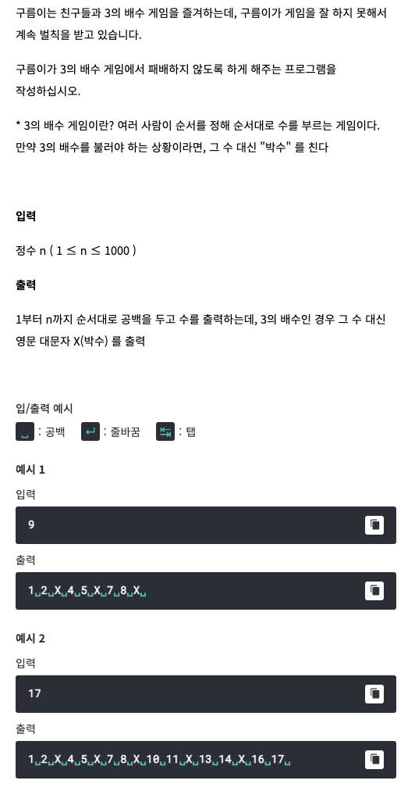

# <기본 문법 문제풀이>  



풀이)
```
rl.on("line", function(line) {

	var result = '';
		for(var i = 1; i <= line; i++) {
			if(i % 3 != 0) {
				result += i + ` `;
			}
			else {
				result += `X` + ` `;
			}
		}
	console.log(result);
	
	
	rl.close();
}).on("close", function() {
	process.exit();
});
```