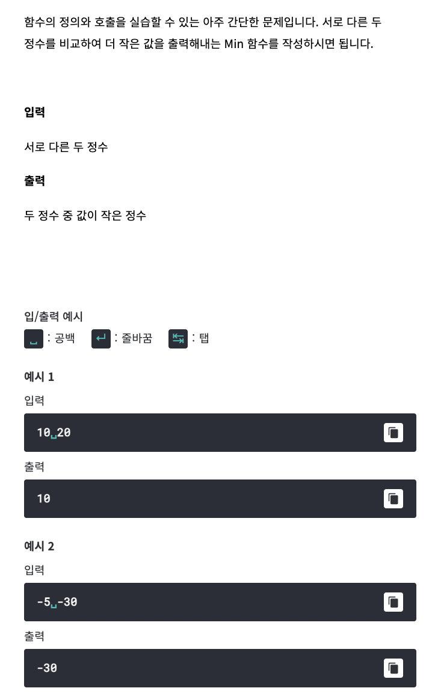

# <알고리즘 문제풀이 기본 문법>



```
const readline = require("readline");
const rl = readline.createInterface({
	input: process.stdin,
	output: process.stdout
});

rl.on("line", function(line) {
	var a = Number(line.split(' ')[0]); 
	var b = Number(line.split(' ')[1]);
		if (a > b) {
			console.log(b)
		}
		else {
			console.log(a)
		}
	
	
	rl.close();
}).on("close", function() {
	process.exit();
});
```


	