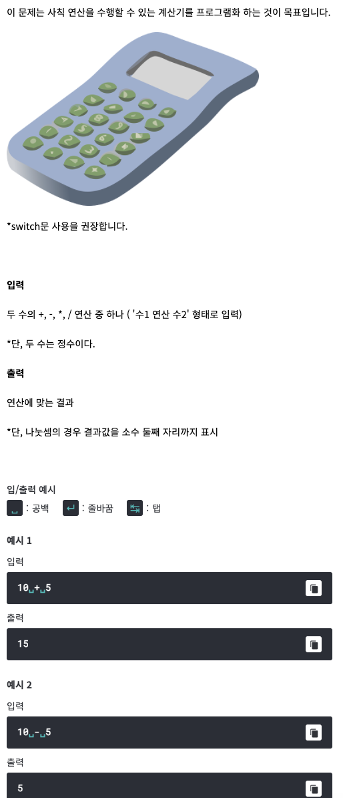

# <기본 문법 문제풀이>

- 풀이)
```
rl.on("line", function(line) {
	
	var number1 = Number(line.split(' ')[0]);
	var number2 = Number(line.split(' ')[2]);
	var cal = line.split(' ')[1];
	
	switch (cal) {
		case '+': console.log(number1 + number2);
			break;
		case '-': console.log(number1 - number2);
			break;
		case '*': console.log(number1 * number2);
			break;
		case '/': console.log((number1 / number2).toFixed(2));
			break;
	}
	
	rl.close();
}).on("close", function() {
	process.exit();
});
```