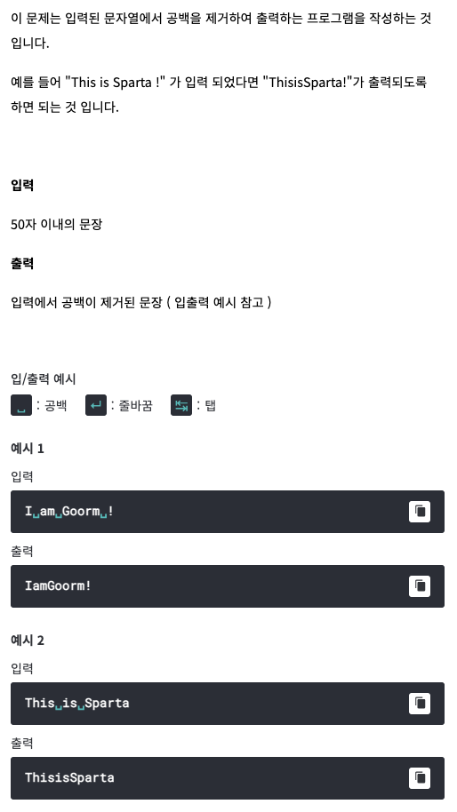

# <기본 문법 문제풀이>


풀이)
```
rl.on("line", function(line) {
	var a = line.split(' ');
	var b = '';
		for(i=0; i<a.length; i++) {
			b += a[i];
		}	
	console.log(b);
	
	rl.close();
}).on("close", function() {
	process.exit();
});
```