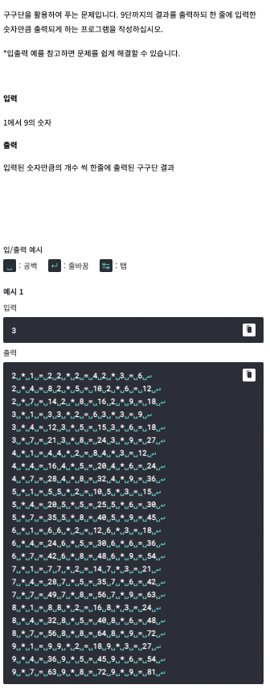

# <기본 문법 문제풀이>  



풀이)
```

rl.on("line", function(line) {
	
		var googoodan = '';
		var count = 0;
		for(var i = 2; i <= 9; i++) {
			for(var j = 1; j <= 9; j++) {
				if (count == line) {
					 googoodan += '\n';
					 count = 0
				}
				googoodan += (i + ' * ' + j + ' = ' + (i * j) + ' ');
				count += 1
			}
		}   
		 console.log(googoodan);

	rl.close();
}).on("close", function() {
	process.exit();
});

```