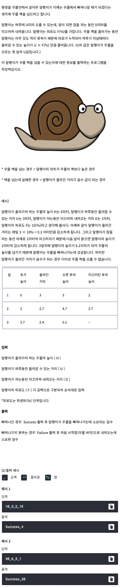

# <기본 문법 문제풀이>

- 풀이)
```

rl.on("line", function(line) {
	var h = Number(line.split(' ')[0]);			//우물높이
	var u = Number(line.split(' ')[1]);			//하루이동가능거리
	var d = Number(line.split(' ')[2]);			//미끄러지는거리
	var f = (Number(line.split(' ')[3]/100))		//피로도
	var day = 0;
	var height = 0;
	var gap = u * f
	
	while(true) {

		day += 1;
		height += u; // <- 최고점

		if(height > h) {
			break;
		}
		height -= d; // <- 밤이 자난거

		if(height < 0) {
			break;
		}	
		u = u - gap
	}

	if (height > h) {
		console.log("Success "+ day);
	} 
	else {
		console.log("Failure "+ day);
	}
	
	
	rl.close();
}).on("close", function() {
	process.exit();
});
```