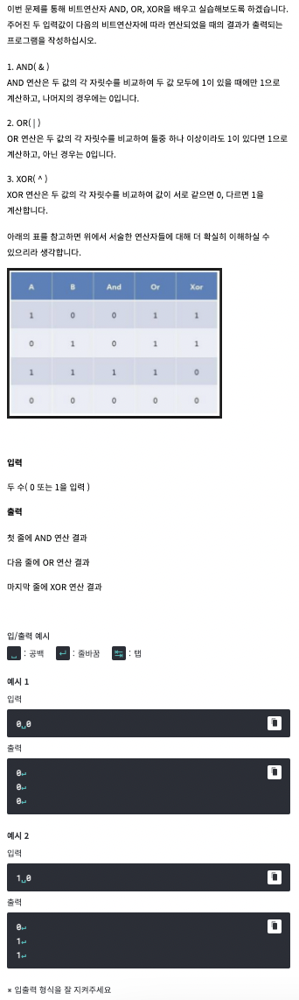

# <기본 문법 문제풀이>


풀이)
```
rl.on("line", function(line) {
	
	var a = Number(line.split(' ')[0]);
	var b = Number(line.split(' ')[1]);
	if(a==1 && b==1) {
		console.log("1");
	}
	else {
		console.log("0")
	}
	if(a==1 || b==1) {
		console.log("1");
	}
	else {
		console.log("0")
	}
	if(a^b) {
		console.log("1");
	}
	else {
		console.log("0")
	}
	
	rl.close();
}).on("close", function() {
	process.exit();
});
```