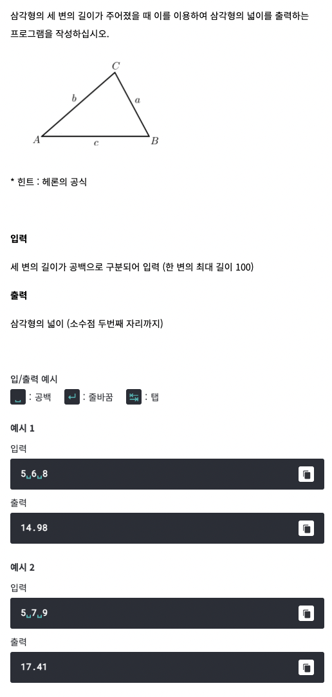

# <기본 문법 문제풀이>


풀이)
```
rl.on("line", function(line) {

	var a = Number(line.split(' ')[0]);
	var b = Number(line.split(' ')[1]);
	var c = Number(line.split(' ')[2]);
	var abc = (a+b+c)/2
	var S = Math.sqrt(abc*((abc-a)*(abc-b)*(abc-c)));
	console.log(S.toFixed(2));
	
	rl.close();
}).on("close", function() {
	process.exit();
});
```