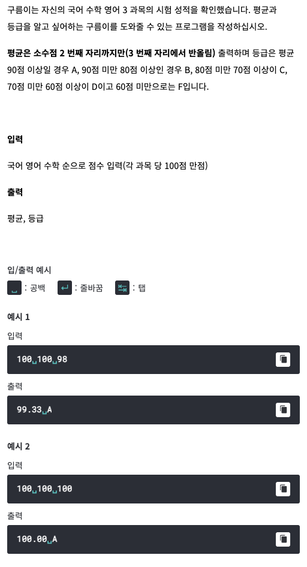

# <기본 문법 문제풀이>


풀이)
```

rl.on("line", function(line) {

	var a = Number(line.split(' ')[0]); 
	var b = Number(line.split(' ')[1]); 
	var c = Number(line.split(' ')[2]); 
	var average = (a+b+c)/3
		if(average >= 90) {
			console.log(average.toFixed(2) + " A");
		}
		if(average < 90 && average >= 80) {
			console.log(average.toFixed(2) + " B");
		}
		if(average < 80 && average >= 70) {
			console.log(average.toFixed(2) + " C");
		}
		if(average < 70 &&  average >= 60) {
			console.log(average.toFixed(2) + " D");
		}
		if(average < 60) {
			console.log(average.toFixed(2) + " F");
		}
			
	rl.close();
}).on("close", function() {
	process.exit();
});
```