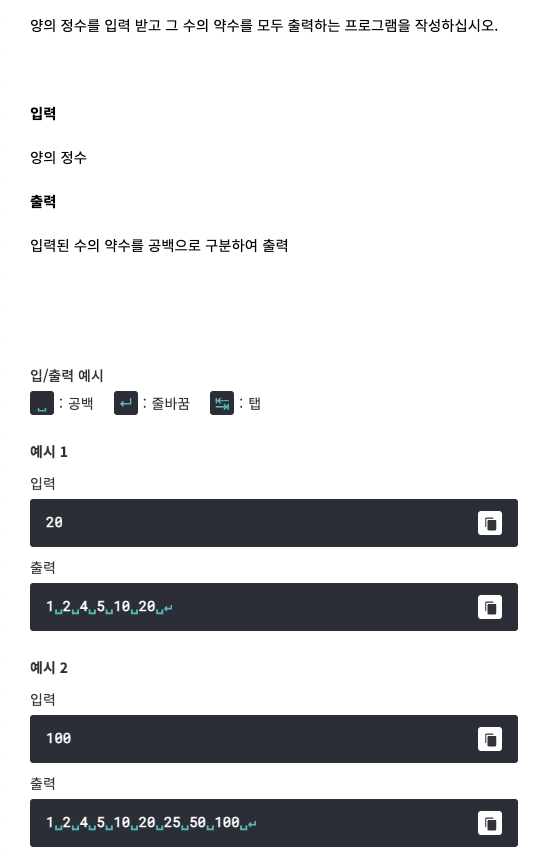

# <기본 문법 문제풀이>



풀이)
```
rl.on("line", function(line) {
		var divisors = ' '
		for(var i = line; i > 0; i--) {			
			var divisor = (line %= i);
		 	if (divisor == 0) {
				divisors = divisor + (" ");
			}
		}
		console.log(divisors);
	
	
	
	rl.close();
}).on("close", function() {
	process.exit();
});
```
