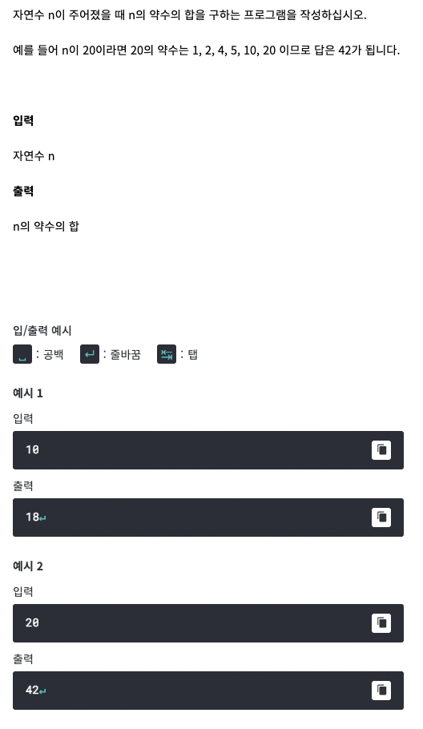

# <기본 문법 문제풀이>



풀이)
```
rl.on("line", function(line) {

	var result = 0;
	for(i = 1; i <= line; i++) {
		if(line % i == 0)
			result += i;
	}
	console.log(result);

	rl.close();
}).on("close", function() {
	process.exit();
});
```
