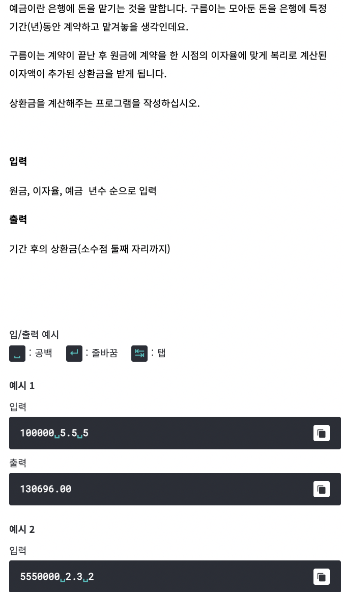

# <기본 문법 문제풀이>



풀이)
```

rl.on("line", function(line) {

	var a = Number(line.split(' ')[0]);
	var b = Number(line.split(' ')[1]);
	var c = Number(line.split(' ')[2]);
	var result = a * Math.pow((1 + (b / 100)), c)
			
	console.log(result.toFixed(2));	
	
	rl.close();
}).on("close", function() {
	process.exit();
});

```