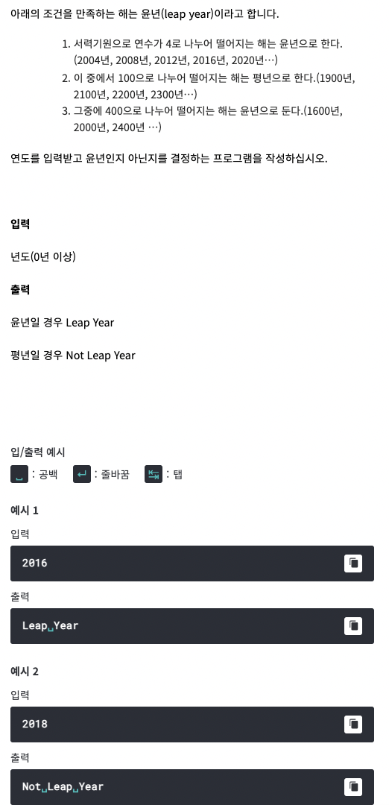

# <기본 문법 문제풀이>

풀이)
```
rl.on("line", function(line) {
    
	if((line%4 == 0 && line%100 != 0) || line%400 == 0) {
		console.log("Leap Year");
	}
	else {
		console.log("Not Leap Year");
	}
	
	rl.close();
}).on("close", function() {
	process.exit();
});
```
