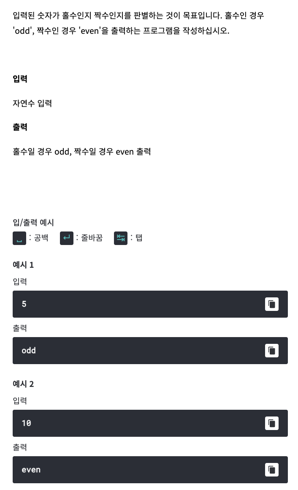

# <기본 문법 문제풀이>  



풀이) 
```
rl.on("line", function(line) {
	
	if ((line % 2) == 0) {
			console.log("even");
	}
	else {
			console.log("odd");
	}
	
	rl.close();
}).on("close", function() {
	process.exit();
});
```
